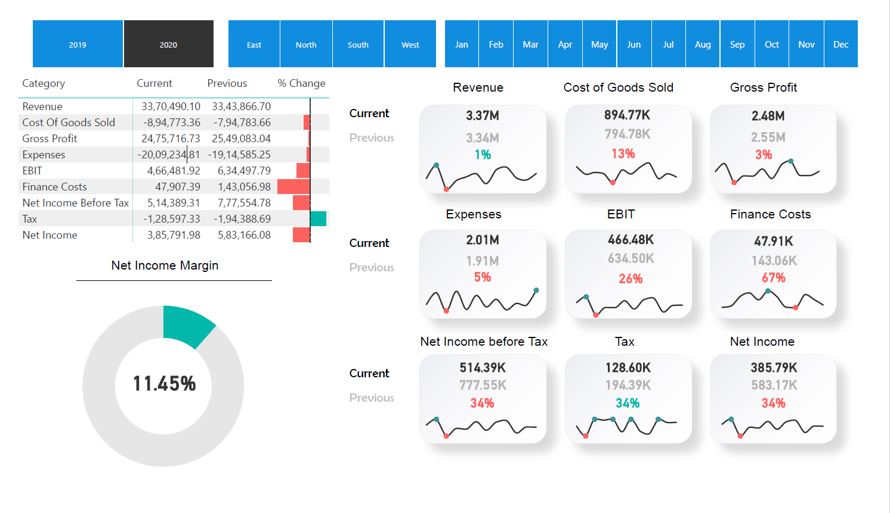

# Income Statement Profile in Power BI Project



The Income Statement profile in the Power BI project offers a comprehensive analysis of an organization's financial performance, focusing on key performance indicators (KPIs) and crucial financial metrics. With this profile, users can gain valuable insights by visualizing and evaluating figures such as Revenue, Gross Profit, Cost of Goods Sold, Expenses, EBIT (Earnings Before Interest and Taxes), Finance Cost, Income Tax, and their year-on-year comparisons, current versus previous values, and percentage changes.

## Table of Contents

1. [Introduction](#introduction)
2. [Revenue Analysis](#revenue-analysis)
3. [Income Tax](#income-tax)
5. [Comparative Analysis](#comparative-analysis)
6. [Current, Previous, and Percentage Change](#current-previous-and-percentage-change)

## Introduction

The Income Statement profile is designed to empower organizations with crucial financial insights. It enables users to delve deep into financial data, identify trends, and make informed decisions that impact the organization's performance and profitability. By visualizing and analyzing key financial metrics, this profile serves as a powerful tool for financial planning, strategizing, and ensuring compliance with regulatory requirements.

## Revenue Analysis

The Revenue Analysis section offers a comprehensive breakdown of your organization's revenue sources, trends, and seasonality. By exploring this data, you can identify the key drivers of revenue growth or decline, make informed decisions, and implement strategies to drive business growth. Understanding revenue patterns helps optimize operational performance and capitalize on emerging opportunities.

## Income Tax

The Income Tax section provides valuable insights into your organization's tax liabilities and effective tax rates. By analyzing various tax components, including corporate income tax, deferred tax assets, and tax provisions, you can ensure compliance with regulatory requirements and identify opportunities for tax optimization. Understanding your tax obligations allows you to minimize tax-related risks and make sound financial decisions.

## EBIT (Earnings Before Interest and Taxes)

Optimize operational performance and profitability with EBIT analysis. By evaluating your organization's EBIT (Earnings Before Interest and Taxes), you can gauge operational efficiency, identify areas for improvement, and maximize profitability. This KPI is instrumental in assessing the core profitability of your business before the impact of financing and tax decisions.

## Comparative Analysis

The Income Statement profile enables you to conduct a comparative analysis between two years, comparing essential financial metrics such as Revenue, Gross Profit, EBIT, Expenses, Finance Cost, Income Tax, and more. By visualizing these comparisons, you can identify trends, spot anomalies, and make data-driven decisions based on historical performance. This feature empowers you to measure progress, identify areas for improvement, and benchmark your organization's performance against industry peers.

## Current, Previous, and Percentage Change

Track the performance trends of KPIs and financial metrics by comparing current and previous values. The ability to monitor percentage changes provides a deeper understanding of your organization's financial health and performance dynamics. These insights can guide strategic decision-making and help steer your organization towards achieving its financial goals.

## How to Use the Income Statement Profile

To use the Income Statement profile in the Power BI project, follow these steps:

1. Clone the repository to your local machine using the following command:
```
git clone https://github.com/Rbhavika17/Income_Statement.git
```

2. Open the Power BI file `income_statement.pbix` using Microsoft Power BI.

3. Interact with the various visualizations and filters to explore your organization's financial data and gain valuable insights.

## Contribution

We welcome contributions to this project! If you have any suggestions, improvements, or additional features to propose, feel free to open an issue or submit a pull request. Together, we can enhance the Income Statement profile and make it even more powerful and useful for financial analysis.

Thank you for your interest in the Income Statement Profile in the Power BI project. We hope this analysis tool helps you make data-driven decisions, optimize financial performance, and drive business growth. Happy analyzing!# Income_Statement
